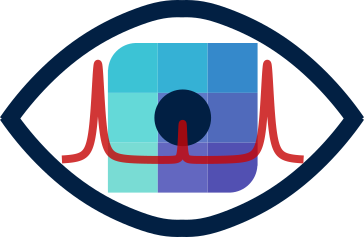

    
    <h1>BrimView</h1>
    <h3><em>A web-based Brillouin viewer and analyzer.</em></h3>

> *Brillouin microscopy is rapidly emerging as a powerful technique for imaging the mechanical properties of biological specimens in a label-free, non-contact manner. Different approaches can be used to acquire the Brillouin signal (e.g. spontaneous, stimulated, time-domain) but ultimately they all collect a spectrum for each voxel in the image. For more information you can find many reviews about the topic, e.g. [Kabakova et al 2024](https://doi.org/10.1038/s43586-023-00286-z) and [Prevedel et al. 2019](https://doi.org/10.1038/s41592-019-0543-3)*  
For images (and volumes and timelapses), we propose a Zarr-based standarized file format to store and analyse Brillouin microscopy data and metadata: [.brim](https://github.com/prevedel-lab/brimfile) (**Br**illouin **Im**age)

**BrimView** is an open-source tool that can read, display, explore and (re)analyze these brim files. 

# Try it for yourself !

Test the online version by clicking [here](https://biobrillouin.org/brimview/ ) (hosted by BioBrillouin). 4 different dataset, from different Brillouin acquisition methods, are available on public S3-buckets.
> _Currently, you need to use a Chromium based browser to be able to run this version_

Use the sidebar to load some data, and then explore the different timepoints of the acquired volumes. Clicking on a pixel displays the underlaying acquired spectra.

# One codebase, multiple deployments options

Thanks to the data exploration and web app framework [Panel](https://github.com/holoviz/panel), the same python code can be used to generate different app versions:

- *Web version*: runs entirely in the browser using [Pyodide](https://pyodide.org) and [WebAssembly (WASM)](https://webassembly.org/). It is ideal for quickly inspecting .brim datasets—e.g., assessing data quality—on any computer without requiring installation.

- *Standalone application*: A fully self-contained desktop version built using [PyInstaller](https://pyinstaller.org/) and [PyWebview](https://pywebview.flowrl.com/), suitable for offline use on lab workstations without requiring a Python environment. Pre-built binaries and source code are available in the [releases]()

- *Local Panel Server*: This version runs as a local Python server, offering the highest performance and full access to the underlying code for advanced users. It supports custom workflows, batch processing, and direct modification of the visualization or analysis pipeline.

 
## Get started with the development
Read through this [guide](./dev_getting_started.md) to install the necessary dependancies, and start working on customizing BrimView. 

## Contributions
Contributions, issue reports, and feature requests are welcome via this GitHub repository.

## Authors
Sebastian Hambura and Carlo Bevilacqua at [Prevedel lab](https://www.prevedel.embl.de/).

## License
Panel is completely free and open-source. It is licensed under the [LGPL-3.0 license](./LICENSE).